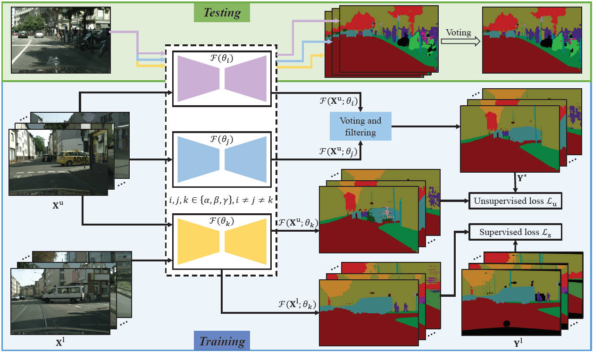

---
title: "Deep Tri-Training for Semi-Supervised Image Segmentation"
authors:
- Shan An
- Haogang Zhu
- Jiaao Zhang
- admin
- Siliang Wang
- Jianqin Yin
- Hong Zhang
date: "2022-06-17T00:00:00Z"
doi: ""

# Schedule page publish date (NOT publication's date).
publishDate: "2022-06-17T00:00:00Z"

# Publication type.
# Legend: 0 = Uncategorized; 1 = Conference paper; 2 = Journal article;
# 3 = Preprint / Working Paper; 4 = Report; 5 = Book; 6 = Book section;
# 7 = Thesis; 8 = Patent
publication_types: ["2"]

# Publication name and optional abbreviated publication name.
publication: IEEE Robotics and Automation Letters, 2022 (JCR Q2, IF = 3.741).
publication_short: '*RA-L* (JCR Q2, IF = 3.741)'

abstract: Semantic segmentation is of great value to autonomous driving and many robotic applications, while it highly depends on costly and time-consuming pixel-level annotation. To make full use of unlabeled data, this work proposes a deep tri-training framework (dubbed DTT) to utilize labeled along with unlabeled data for training in a semi-supervised manner. Concretely, in the DTT framework, three networks are initialized with the same structure but different parameters. The networks are optimized circularly, where one network is trained in each optimization step with the guidance of the other two networks. A simple yet effective voting mechanism is adopted to construct reliable training sets from unlabeled data for the training stage and fusing multi-experts prediction in the testing stage. Exhaustive experiments on Cityscapes and PASCAL VOC 2012 demonstrate that the proposed DTT realizes state-of-the-art performance in the semi-supervised segmentation task. The source code is available in the supplementary material and will be made publicly available.

# Summary. An optional shortened abstract.
# summary:

tags:
- Object Detection
- Segmentation and Categorization
- Semantic Scene Understanding
- Deep learning for visual perception
- Deep Learning Methods
featured: false

links:
#- name: Custom Link
#  url: http://example.org
url_pdf: ''
url_code: ''
url_dataset: ''
url_poster: ''
url_project: ''
url_slides: ''
url_source: ''
url_video: ''

# Featured image
# To use, add an image named `featured.jpg/png` to your page's folder. 
image:
  caption: ""
  focal_point: ""
  preview_only: false

# Associated Projects (optional).
#   Associate this publication with one or more of your projects.
#   Simply enter your project's folder or file name without extension.
#   E.g. `internal-project` references `content/project/internal-project/index.md`.
#   Otherwise, set `projects: []`.
# projects:
# - internal-project

# Slides (optional).
#   Associate this publication with Markdown slides.
#   Simply enter your slide deck's filename without extension.
#   E.g. `slides: "example"` references `content/slides/example/index.md`.
#   Otherwise, set `slides: ""`.
# slides: example

# <!-- 

# 
# <small>Overall performance of SOTA trackers with the proposed SCT enabled (markers in a dark color) or not (markers in a light color) in the newly constructed nighttime UAV tracking benchmark---DarkTrack2021. SCT significantly boosts the nighttime tracking performance of trackers in a plug-and-play manner.</small>
# 
 -->

---